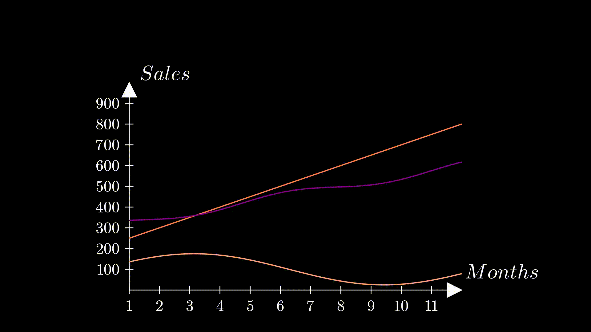

# Dataviz AI

The AI-Powered Infographic Video Generator is a user-friendly tool that uses GenAI to turn text or structured files (eg. CSV, JSON) into ready to use infographic videos, automatically choosing the most effective visualization methods for the data.




[Demo Video](https://www.youtube.com/watch?v=czEbaWtR0m0)

## Dependencies

### Python Dependencies
- langchain_google_genai
- django
- manim
- python-dotenv

### Aditional Dependencies

For debian:
```bash
sudo apt update && sudo apt upgrade
sudo apt install libcairo2-dev ffmpeg texlive texlive-latex-extra texlive-fonts-extra texlive-latex-recommended texlive-science tipa libpango1.0-dev
```

## Setup & Run

### Docker Install
```bash
docker build -t dataviz_ai .
docker run -p 8000:8000 dataviz_ai
```

### Manual Install
1. Create `.env` file with your Gemini AI API key in it
```
GOOGLE_API_KEY=your-api-key-here
```

2. Run the following command
```
python -m venv .venv
source .venv/bin/activate
pip install -r requirements.txt
python manage.py runserver
```

3. Open `localhost:8000` on your browser.
